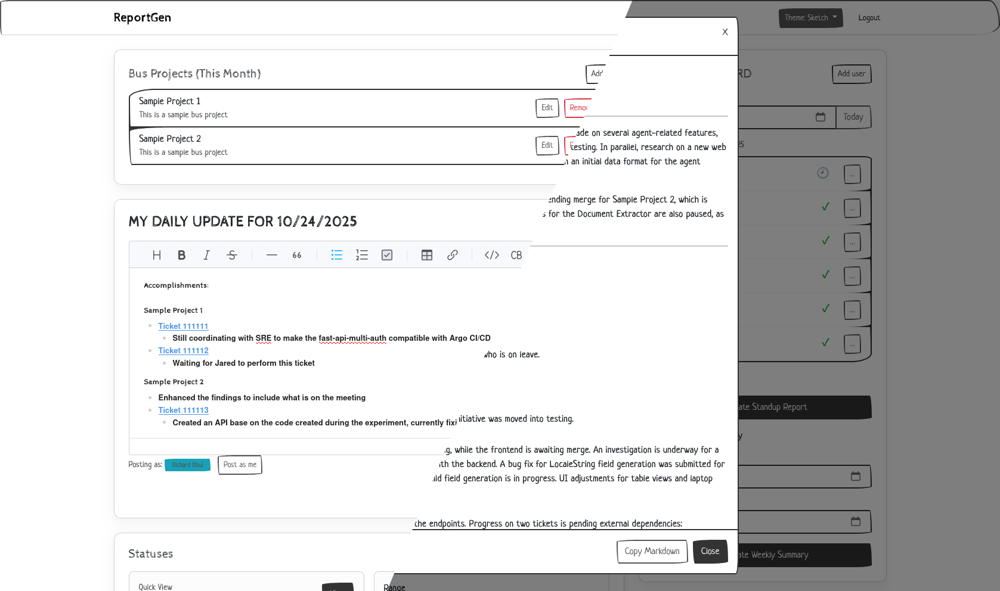

# Report Generator Server




A Laravel-based team status reporting application. It helps teams capture daily updates, compile weekly summaries, and share consolidated reports quickly. The core web app lives in `reportgen/` and provides:

- Post daily status entries (Markdown) per user and date
- Post “as another user” from the dashboard (for PMs/team leads)
- Daily and weekly reports rendered in Bootstrap modals (AJAX)
- View team status entries by date or by date range
- Gemini-first LLM summarization pipeline with templated prompts
- In-app user management (admin-only): add, edit, and remove team members
- LLM JSON proxy endpoint with CORS and basic rate limiting

## Repository layout

- `src/` — the Laravel 12 application (PHP 8.2) containing app code, Composer dependencies, and public assets
- `src/README.md` — detailed developer guide with setup steps, environment configuration, and directory structure explanations
- `docs/` — supplementary documentation, including `HOSTING.md` (shared hosting guide), `TEAM_STRUCTURE.md` (operational cadence defaults), `MULTI_TEAM_SETUP.md` (multi-team deployment model), and `prototype.epgz` (Pencil wireframes; open with [Pencil](https://pencil.evolus.vn/))

## Requirements

- PHP 8.2+
- Composer 2+
- MySQL 8+ (or compatible) — configure via `.env`
- Node.js 18+ and npm (optional, for Vite/dev UX)

Typical PHP extensions for Laravel should be installed (openssl, pdo, mbstring, tokenizer, xml, ctype, json, fileinfo).

## Additional operational docs

- [Team Structure & Reporting Cadence](docs/TEAM_STRUCTURE.md) — documents the monthly "bus" project rhythm, daily standup expectations, and Azure DevOps variables required to enrich reports, including the `ORGANIZATION_URL`, `PERSONAL_ACCESS_TOKEN`, `ADO_PROJECT`, and `ADO_API_VERSION` settings now found in `.env.example`.
- [Multi-Team Deployment Guide](docs/MULTI_TEAM_SETUP.md) — explains the duplicated-`src` architecture used to isolate each team with its own database, directory layout, and maintenance workflow.

## Quick start

1) Clone and enter the app folder

 ```bash
 git clone <your-repo-url> report-generator-server
 cd report-generator-server/reportgen
 ```

2) Install PHP dependencies

 ```bash
 composer install
 ```

3) Configure environment

Copy `.env.example` to `.env` (if needed) and set the following:

 ```ini
 APP_NAME="Report Generator"
 APP_ENV=local
 APP_KEY=
 APP_DEBUG=true
 APP_URL=http://127.0.0.1:8000
 
 DB_CONNECTION=mysql
 DB_HOST=127.0.0.1
 DB_PORT=3306
 DB_DATABASE=reportgen
 DB_USERNAME=root
 DB_PASSWORD=
 
 # LLM configuration
 GEMINI_API_KEY=your_gemini_key
 GEMINI_MODEL=gemini-2.5-flash-preview-05-20
 # Optional fallbacks
 OPENAI_API_KEY=
 OPENAI_MODEL=gpt-4o-mini
 
 # CORS allowlist for the /llm proxy (comma-separated; supports wildcards)
 LLM_ALLOWED_ORIGINS=http://localhost,http://127.0.0.1
 
 SESSION_DRIVER=file
 ```

Then generate the app key:

 ```bash
 php artisan key:generate
 ```

4) Run database migrations and seeders

 ```bash
 php artisan migrate --force
 php artisan db:seed --force
 ```

Seeder creates three users (password: `password`):
- test@example.com (admin)
- ronald@example.com
- terrence@example.com

5) (Optional) Frontend build/dev server

 ```bash
 npm install
 npm run dev
 ```

Or you can use the convenience Composer script (requires Node):

 ```bash
 composer run dev
 ```

6) Run the app

 ```bash
 php artisan serve
 ```

Visit http://127.0.0.1:8000 and log in with a seeded user.

## Key features and endpoints

- Dashboard: `GET /dashboard`
    - Click date picker to change working date
    - Click a user avatar to “post as” that user
    - If a status exists for the selected user/date, it auto-loads into the editor
    - Admin-only actions: Add, Edit, Remove team members

- Reports
    - Daily report (modal): `GET /reports/daily?date=YYYY-MM-DD`
    - Weekly report (modal): `GET /reports/weekly?start=YYYY-MM-DD&end=YYYY-MM-DD`

- Statuses
    - By date: `GET /statuses?date=YYYY-MM-DD`
    - By range: `GET /statuses/range?start=YYYY-MM-DD&end=YYYY-MM-DD`

- Entries (AJAX helpers)
    - Fetch a user’s entry for a date: `GET /entries/fetch?user_id=ID&date=YYYY-MM-DD`
    - Publish: `POST /entries/publish`

- LLM proxy (CORS-enabled)
    - `POST /llm` — forwards JSON payload to Gemini using `GEMINI_API_KEY`

## Maintenance & operations

For day-to-day upkeep, refer to [docs/MAINTENANCE.md](docs/MAINTENANCE.md). It consolidates configuration cache management, migrations, scheduler/queue supervision, prompt upkeep, admin role practices, troubleshooting checklists, and upgrade workflows originally captured here and in `src/README.md`.

## License

MIT (see repository license if provided).
